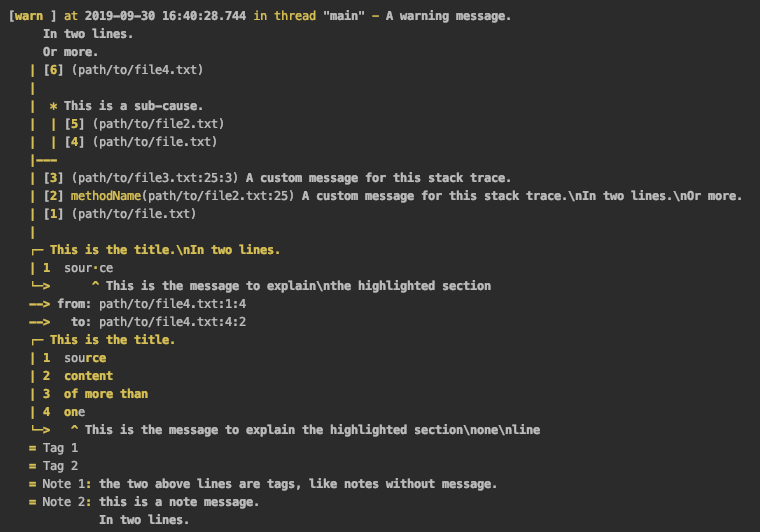

# kterm

A mix between a terminal logger and a terminal input for kotlin. Its syntax is based on the [Rust](https://www.rust-lang.org/) compiler syntax.

## API

See [API](./doc/md/index.md)

## Log examples

### Logging an Exception

To log an `Exception` showing the date, the thread and the execution order, use:

```kotlin
Logger.error(this) {
    showDate()
    showThread()
    showStackExecutionOrder()
}
```

Which will show in IntelliJ something like:


### Logging simple info message

In this example we perform two logs, the first in the info `level` just with one message, the simplest log format, and the second one in the `debug` level with the date, the thread and two notes.

Notes are tagged messages that give more contextual information about the logged message.

```kotlin
Logger.info("This is the message of the info log")
Logger.debug("This is the message of the debug log.\nEvery multiline string is correctly indented.") {
    showDate()
    showThread()
    addNote("hint", "this can be a multiline\nstring too")
    addNote("<hint 2>", "many notes can be set in just one log")
}
```

This shows in IntelliJ:


### Full example

Finally a full example with all the properties will be something like this.

Note that the stack trace is represented in the reverse way that you input the stack traces, because the first methods usually are represented at the bottom.

```kotlin
Logger.warn("A warning message.\nIn two lines.\nOr more.") {
    showDate()
    showThread()

    // Custom stack.
    stack("This is the main message of the stack.") {
        addStackTrace {
            location("path/to/file.txt")
        }
        addStackTrace {
            location("path/to/file2.txt", line = 25)
            message("A custom message for this stack trace.\nIn two lines.\nOr more.")
            method("methodName")
        }
        addStackTrace {
            location("path/to/file3.txt", line = 25, column = 3)
            message("A custom message for this stack trace.")
        }

        addCause("This is a sub-cause.") {
            addStackTrace {
                location("path/to/file.txt")
            }
            addStackTrace {
                location("path/to/file2.txt")
            }
        }

        addStackTrace {
            location("path/to/file4.txt")
        }
    }

    // Add custom source code hints.
    addSourceCode("source\ncontent\nof more than\none\nline") {
        title("This is the title.\nIn two lines.")
        highlightAt(row = 1, column = 3)
        message("This is the message to explain\nthe highlighted section")
    }

    addSourceCode("source\ncontent\nof more than\none\nline", "path/to/file4.txt") {
        title("This is the title.")
        highlightSection(rowFrom = 1, columnFrom = 2, rowTo = 4, columnTo = 2)
        message("This is the message to explain the highlighted section\none\nline")
    }

    addTag("Tag 1")
    addTag("Tag 2")
    addNote("Note 1", "the two above lines are tags, like notes without message.")
    addNote("Note 2", "this is a note message.\nIn two lines.")
}
```

This shows in IntelliJ:



## Prompt examples

### Confirm prompt

The confirm prompt, as its name says, is used to confirm an action with user.

```kotlin
var response = Prompt.confirm("This is a confirmation message")
Logger.info("$response\n")

response = Prompt.confirm("This is a multiline\nconfirmation message") {
    promptColor(AnsiColor.Red)
}
Logger.info("$response\n")

response = Prompt.confirm("This is a multiline\nconfirmation message") {
    defaultValue(true)
}
Logger.info("$response\n")
```

Which will show in IntelliJ something like this:


### Inline confirm prompt with error message

The confirm prompt, as its name says, is used to confirm an action with user.

```kotlin
var response = Prompt.confirm("This is a confirmation message") {
    inlineAnswer()
}
Logger.info("$response\n")

response = Prompt.confirm("This is a multiline\nconfirmation message") {
    inlineAnswer()
}
Logger.info("$response\n")
```

In IntelliJ:


### Menu

The menu prompt shows a list of options and allows the user to select one of them.

```kotlin
var response = Prompt.menu("This is a menu message") {
    addOption("Tag1", "This is the explanation of the option")
    addOption("Tag2")
    addOption("Tag3", "This is the explanation of the option\nin more than one line")
}
Logger.info("$response\n")

response = Prompt.menu("This is a menu message") {
    addOption("Tag1", "This is the explanation of the option")
    addDefaultOption("default", "This is the default option")
}
Logger.info("$response\n")
```

After the execution in IntelliJ:


### Menu with actions

In every option you can add a custom action to be executed whenever the option is selected.

```kotlin
val response = Prompt.menu("This is a menu message") {
    addOption("hello", "Say hello!"){
        Logger.debug("Hello you all!, I'm the hello option.")
    }
    addDefaultOption("default") {
        Logger.warn(":( you haven't type anything")
    }
}
Logger.info("Selected option = $response\n")
```

After execute it two times in IntelliJ:


